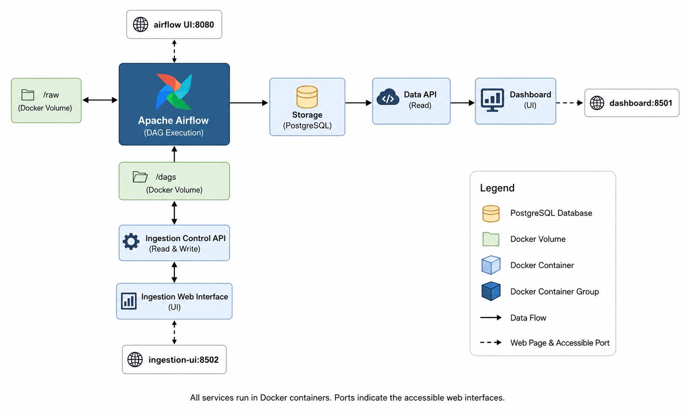

# Open Media Intelligence Platform

A self-hosted OSINT platform for ingesting and transforming heterogeneous news sources into structured, searchable, and semantically enriched intelligence.

Live TV and radio sources are supported out of the box. The platform is designed to run continuously, periodically collecting information from configured sources and making the processed results available through an interactive dashboard.

[<video src="video.mp4" controls width="700"></video>
](https://private-user-images.githubusercontent.com/72304309/616974602-8d1b7f6f-9c4b-41c2-9d09-4937145d2dbd.mp4?jwt=eyJ0eXAiOiJKV1QiLCJhbGciOiJIUzI1NiJ9.eyJpc3MiOiJnaXRodWIuY29tIiwiYXVkIjoicmF3LmdpdGh1YnVzZXJjb250ZW50LmNvbSIsImtleSI6ImtleTUiLCJleHAiOjE3ODMxMDM5NzksIm5iZiI6MTc4MzEwMzY3OSwicGF0aCI6Ii83MjMwNDMwOS82MTY5NzQ2MDItOGQxYjdmNmYtOWM0Yi00MWMyLTlkMDktNDkzNzE0NWQyZGJkLm1wND9YLUFtei1BbGdvcml0aG09QVdTNC1ITUFDLVNIQTI1NiZYLUFtei1DcmVkZW50aWFsPUFLSUFWQ09EWUxTQTUzUFFLNFpBJTJGMjAyNjA3MDMlMkZ1cy1lYXN0LTElMkZzMyUyRmF3czRfcmVxdWVzdCZYLUFtei1EYXRlPTIwMjYwNzAzVDE4MzQzOVomWC1BbXotRXhwaXJlcz0zMDAmWC1BbXotU2lnbmF0dXJlPThhNzY2MzE1NmMxZDgzMzdhMmNhNzg5NmYwYjkwY2YzY2ZhNWIxNDUyNjA5MTUxOWJkMzkyZDQ4ZDQ0OTc4MDEmWC1BbXotU2lnbmVkSGVhZGVycz1ob3N0JnJlc3BvbnNlLWNvbnRlbnQtdHlwZT12aWRlbyUyRm1wNCJ9.Hr34ZAPvNWPMtV6VjJD8-QxVF2wJr6hklHRqj4pHm1c)

## Requirements

Before starting the platform, make sure the following tools are installed:

- Git
- Docker Engine
- Docker Compose

## Try It Yourself

### 1. Clone the repository

```bash
git clone <repository-url>
cd <repository-directory>
```

### 2. Build the TV and radio connector

From the repository root, run:

```bash
cd connectors/TV_Radio_connector
docker image build -t connector_tv_radio_image:latest .
```

### 3. Start the platform

```bash
cd ../../services
docker compose up -d
```

This starts all platform services and enables scheduled data collection for the configured DAGs.

You can verify that the services are running with:

```bash
docker compose ps
```

### 4. Open the web interfaces

The platform exposes three main interfaces:

- [Ingestion UI](http://localhost:8502/) — configure sources, connectors, and scheduled ingestion workflows.
- [Airflow UI](http://localhost:8080/) — monitor DAG executions, inspect task logs, and trigger workflows manually.
- [Dashboard](http://localhost:8501/) — explore and analyze the collected and enriched intelligence.

The dashboard may initially appear empty because the platform has not collected any data yet.

Open Media Intelligence Platform is designed to run continuously. The longer it remains active, the more historical information it can collect and the more useful its trends, entities, keywords, and other analytical results become.

## How the Platform Works



The platform separates ingestion, processing, storage, and visualization into independent Docker services.

### 1. External sources and connectors

External information sources are the starting point of the data flow. These sources may include television broadcasts, online radio stations, digital media, or other publicly available resources.

Connectors isolate the platform from the technical differences between these sources. Each connector is responsible for:

1. Accessing one or more compatible sources.
2. Collecting the available content.
3. Preserving the original output when required.
4. Transforming each collected item into the platform's common JSON schema.

For audiovisual sources, the connector captures the stream and generates a textual and structured representation that can be processed by the rest of the platform.

Connectors do not perform semantic analysis, database persistence, or visualization. These responsibilities belong to other services.

### 2. Airflow orchestration

Apache Airflow coordinates the complete data lifecycle through DAGs.

Each ingestion DAG normally performs three main stages:

1. Run a connector to collect and normalize information.
2. Process the normalized records through the NLP pipeline.
3. Insert the enriched records into PostgreSQL.

DAGs may run periodically according to their configured schedule or may be triggered manually from the Airflow UI.

The Airflow interface is available at:

[http://localhost:8080/](http://localhost:8080/)

Use it to:

- Check whether a DAG was loaded successfully
- Monitor active and previous executions
- Trigger a DAG manually
- Inspect individual task states
- Review logs when a task fails
- Retry failed tasks

### 3. Raw and normalized data

Connector outputs are stored in shared Docker volumes.

The `/raw` volume preserves the original connector output before normalization or enrichment. Keeping this information is useful for:

- Traceability
- Debugging connector errors
- Auditing collected content
- Reprocessing historical data
- Applying future schema or NLP improvements

Normalized JSON records are passed to the NLP pipeline using the common platform schema.

### 4. NLP enrichment

The NLP pipeline adds semantic information and derived metadata to each normalized record.

Depending on the enabled processing modules, this may include:

- Named entities
- Keywords
- Topics
- Categories
- Sentiment
- Threat-related classifications
- Other attributes derived from the content

The original connector fields remain separate from the analytical results. NLP outputs are grouped under the `nlp_pipeline` field, allowing new processing modules to be added without redesigning the base schema.

### 5. PostgreSQL storage

After enrichment, records are stored in a centralized PostgreSQL database.

PostgreSQL stores both structured metadata and semistructured NLP results. This makes it possible to query records from different source types through a consistent data model.

The database is not accessed directly by the dashboard.

### 6. Data API

A read-only API provides controlled access to the information stored in PostgreSQL.

The API centralizes query and aggregation logic and prevents client applications from depending on the database implementation.

It can expose information such as:

- Individual intelligence records
- Available sources
- Date and language filters
- Entities and keywords
- Aggregated metrics
- Trends over time

Although the dashboard is currently the main API consumer, additional services can use the same API in the future, including alerting systems, external analysis tools, autonomous agents, or custom applications.

### 7. Dashboard

The dashboard is available at:

[http://localhost:8501/](http://localhost:8501/)

It consumes the read-only data API and provides an interactive interface for exploring processed information.

Depending on the available data and enabled NLP modules, it can be used to analyze:

- Transcriptions and collected articles
- Sources and countries
- Languages
- Named entities
- Keywords
- Trends
- Content categories
- Other enriched attributes

The dashboard only displays data that has already been collected, processed, and inserted into PostgreSQL.

### 8. Ingestion management

The ingestion management interface is available at:

[http://localhost:8502/](http://localhost:8502/)

It provides a visual interface for managing the ingestion configuration without manually editing the internal JSON files.

Use the Ingestion UI to:

- Register and edit sources
- Review available connectors
- Associate sources with compatible connectors
- Configure connector parameters
- Create scheduled DAGs
- Define execution intervals
- Update existing ingestion workflows

Behind the interface, the platform separates its configuration into three main concepts:

- `seed_list.json` contains the available external sources.
- `connectors.json` describes the registered connectors and their supported parameters.
- `dags.json` defines scheduled executions, including their connector, sources, parameters, and schedule.

When a DAG is created or updated, the ingestion control service generates the corresponding Python DAG file in the shared `/dags` volume. Airflow then detects and loads the generated workflow.

## Recommended Workflow

A typical workflow for adding and collecting information is:

1. Open the Ingestion UI.
2. Add or review the source in the seed list.
3. Register the connector that supports the source type.
4. Create a DAG that associates the connector with one or more sources.
5. Configure the connector parameters and execution schedule.
6. Save the configuration and wait for Airflow to load the generated DAG.
7. Open the Airflow UI and verify that the DAG is available.
8. Wait for the scheduled execution or trigger it manually.
9. Check the task logs if the execution fails.
10. Open the dashboard after the first records have been processed.

## Add Your Own Sources

To add new types of sources, you must create or reuse a compatible connector.

A connector is an isolated Docker application that knows how to access a specific source type and convert its content into the common platform schema.

For example, separate connectors could be implemented for:

- Television and radio streams
- RSS feeds
- News websites
- Social networks
- Public APIs
- Government publications
- Other open data sources

A single connector may support multiple sources when they share the same collection mechanism.

## Build a Connector

Each connector must be packaged as a Docker image and comply with the platform's input, output, naming, and metadata conventions.

At a minimum, a connector must:

1. Accept its source URLs after the `-i` parameter.
2. Write raw outputs to `/outputs/raw`.
3. Write normalized JSON records to `/outputs/common`.
4. Generate one common-schema JSON file per collected item.
5. Read execution and source metadata from environment variables.
6. Use a Docker `ENTRYPOINT` that allows Airflow to append runtime parameters.
7. Avoid implementing NLP, database, or visualization logic.

For the complete specification, see:

[How to Build a Connector](./services/1_ingestion/docs/guide_to_building_connectors.md)

After building the connector image, register it through the Ingestion UI or in the connector configuration.

## Create DAGs

Use the Ingestion UI to create ingestion DAGs.

When creating a DAG, select or configure:

- The connector to execute
- One or more input sources
- Connector-specific parameters
- The execution schedule
- A unique DAG identifier

The platform generates the Airflow DAG automatically. Each generated workflow runs the connector, processes its normalized outputs through the NLP pipeline, and inserts the enriched records into PostgreSQL.

A connector image can be reused by multiple DAGs with different sources, parameters, or schedules.

## Collect Data

After the DAGs have been created, keep the platform running so Airflow can execute them according to their schedules.

You can also run a DAG manually from the Airflow UI when you need an immediate collection.

To inspect the platform logs, run:

```bash
cd services
docker compose logs -f
```

To inspect a specific service:

```bash
docker compose logs -f <service-name>
```

To stop the platform:

```bash
docker compose down
```

Stopping the containers does not necessarily remove persistent Docker volumes. To avoid losing collected data, do not delete the volumes unless you intentionally want to reset the platform.